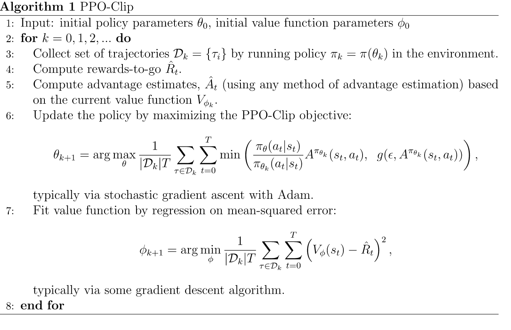

# Proximal Policy Optimization

## Basic Concept

$$
\text{Critic Net} : \underbrace{\mathbb R^4}_\text{state vector} \to \underbrace{\mathbb R}_\text{state value}
$$

$$
\text{Actor Net} : \underbrace{\mathbb R^4}_\text{state vector} \to \underbrace{\mathbb R^2}_\text{action logits}
$$

* Suppose that our environment has a **4-dimensional continuous state space** and **two discrete actions**.

$$
\text{Actor Net}(s_t; \theta) = \pi_\theta(a_t | s_t)
$$

* So the actor network takes 4D state vectors and returns the logits of an action given a state.
* In other words, the actor network returns the distribution of an action given a state — which is the same as a policy function's role.

$$
\text{Critic Net}(s_t; \phi) = V_\phi(s_t)
$$

* And the critic network returns the value of state.

## How to Train Actor Net (Policy)

* To train our actor network, first of all, we should define the loss function.
* It is define as follow :

$$
\begin{align} L(s,a,\theta_k,\theta) &= -\min\left( \frac{\pi_{\theta}(a|s)}{\pi_{\theta_k}(a|s)}  A^{\pi_{\theta_k}}(s,a), \text{clip}\left(\frac{\pi_{\theta}(a|s)}{\pi_{\theta_k}(a|s)}, 1 - \epsilon, 1+\epsilon \right) A^{\pi_{\theta_k}}(s,a)\right)\\
&= -\min\left(\frac{\pi_{\theta}(a|s)}{\pi_{\theta_k}(a|s)}  A^{\pi_{\theta_k}}(s,a),~g(\epsilon,~ A^{\pi_{\theta_k}}(s,a))\right) \end{align}
$$

* where $\pi_\theta$ is our new policy, and $\pi_{\theta_k}$ is the old policy. 

$$
g(\epsilon, A) = \begin{cases}
    (1 + \epsilon) A & A \geq 0 \\
    (1 - \epsilon) A & A < 0
   \end{cases}
$$

* So we can decompose our loss function as follow :

$$
-L(s,a,\theta_k,\theta) = \begin{cases}
\min\left[
\frac{\pi_{\theta}(a|s)}{\pi_{\theta_k}(a|s)}, (1 + \epsilon)
\right] \times  A^{\pi_{\theta_k}}(s,a) & _{\text{if}~~A^{\pi_{\theta_k}} \ge 0}
\\
\max\left[
\frac{\pi_{\theta}(a|s)}{\pi_{\theta_k}(a|s)}, (1 - \epsilon)
\right] \times  A^{\pi_{\theta_k}}(s,a) 
& _{\text{if}~~A^{\pi_{\theta_k}} < 0} \end{cases}
$$

* In this loss function equation, there's a kind of **regularization** for new policy ($\pi_\theta$).
* When the advantage is positive, the objective will increase if the action becomes more likely—that is, if $\pi_{\theta}(a|s)$ increases. 
* But <mark>the **min** in this term puts a **limit** to how *much* the objective can increase.</mark> 
* Once $\pi_{\theta}(a|s) > (1+\epsilon) \pi_{\theta_k}(a|s) $, the min kicks in and this term hits a ceiling of $(1+\epsilon) A^{\pi_{\theta_k}}(s,a)$. 
* Thus, <mark>the new policy does not benefit by going far away from the old policy.</mark>

* Likewise, when the advantage is negative, the objective will increase if the action becomes less likely—that is, if $\pi_{\theta}(a|s)$ decreases. 
* But the max in this term puts a limit to how *much* the objective can increase. 
* Once $\pi_{\theta}(a|s) < (1-\epsilon) \pi_{\theta_k}(a|s)$, the max kicks in and this term hits a ceiling of $(1-\epsilon) A^{\pi_{\theta_k}}(s,a)$. 
* Thus, again <mark>the new policy does not benefit by going far away from the old policy.</mark>

## Advantage Estimates

* In our example code, our advantage estimate is computed as follow:

$$
\delta_t = \underbrace{r_t + \gamma V_\phi(s_{t+1})}_{\text{the estimated value of}~ s_t} - 
\underbrace{V_\phi(s_t)}_\text{value func as baseline} \\
$$

$$
\hat A_t = \sum_{i=t}^T  (\gamma \lambda )^{T-i}\delta_i
$$

* where $r_t + \gamma V_\phi(s_{t+1})$ is the estimated state $s_t$ value which is based on the Bellman equation.

## Rewards-to-go Etstimates

* Our reward-to-go estimate is computed as follow:

$$
\hat R_t = \sum_{i=t}^T \gamma^{T-i} \underbrace{r_i}_\text{reward}
$$

* where the reward $r_i$ is collected by our agent's journey.
* Basically our critic network, or value function, targets to predict a state value.
* And a state value is basically an expectation of a return, and the return is a discounted sum of future rewards.
* So, it makes sense to define the critic-net's loss as $\text{MSE}(V_\phi(s_t),~ \hat R_t)$

## References

1. OpenAI Spinning Up : [Proximal Policy Optimization](https://spinningup.openai.com/en/latest/algorithms/ppo.html).
2. Illias Chrysovergis (2021). ["Proximal Policy Optimization
"](https://keras.io/examples/rl/ppo_cartpole/) (Keras Tutorial).
3. John Schulman, Filip Wolski, Prafulla Dhariwal, Alec Radford, Oleg Klimov (OpenAI) (2017). ["Proximal Policy Optimization Algorithms"](https://arxiv.org/abs/1707.06347).
